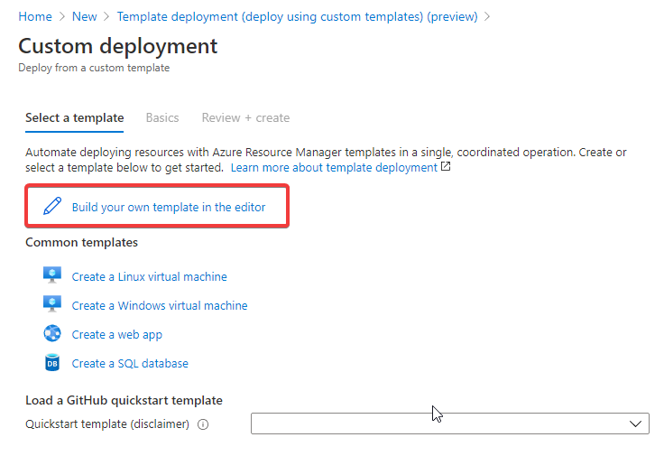

# Lab 4: Publishing a VM Offer

## Introduction

*Virtual Machine offers* are used to deploy and transact a virtual machine (VM) instance through Marketplace. The solution must consist of a single VM. Anything more complex requires an *Azure Apps offer*.

When a customer 'purchases' a *VM offer*, the VM will be deployed into the customer's Azure subscription. As a consequence, VM offers can only be published in *Azure Marketplace* (not *AppSource*).

*VM offers* support the *Transact* listing type. They also support the *BYOL* listing type (and, by offering limited time licences via a *BYOL* listing, they also support free trials). A *Test drive* option is also available.

Transact *VM offers* are billed on a usage-based PAYG (Pay As You Go) model. Each plan can be created with a free trial option giving you the option to offer customers a 1 / 3 / 6 month period with no licence fees.

## Prerequisites

* An Azure subscription (required)
* Azure CLI (required)
* A [Partner Center account](lab2-partnercenter.md) with the appropriate permissions (some of the material can be completed without Partner Center access)

## Overview

In this lab we will create the technical assets required to publish a VM offer to the commercial marketplace. The high level steps required to do this are as follows:

1. Create a VM to use as a base
2. Configure the VM
3. Perform security checks
4. Apply any custom configuration and scheduled tasks as required
5. Generalise the image
6. Capture the disk and store as a VHD in a Storage Account
7. When creating a VM offer you will provide a SAS URL to the VHD

## Create a VM to use as a base

We will create a VM using an approved base image. However it is also possible to [create and deploy your own VM image](https://docs.microsoft.com/en-us/azure/marketplace/azure-vm-create-using-own-image). Starting from an approved base image simplifies the process.

There are numerous way we could create the VHD. In this lab we will use the Azure CLI. [Packer is a useful tool](https://azurecitadel.com/automation/packeransible/lab1/) for helping to automate the process.

### Create a VM using the Azure CLI

1. Create a new resource group using the Azure CLI

   ```bash
   az group create --name marketplace-vm-offer --location westeurope
   ```

   Example output

   ```json
      {
         "id": "/subscriptions/xxxxxxxx-xxxx-xxxx-xxxx-xxxxxxxxxxxx/resourceGroups/marketplace-vm-offer",
         "location": "westeurope",
         "managedBy": null,
         "name": "marketplace-vm-offer",
         "properties": {
            "provisioningState": "Succeeded"
         },
         "tags": null,
         "type": "Microsoft.Resources/resourceGroups"
      }
   ```

2. Create the VM

   We will create an Ubuntu VM using a small machine size to minimise costs. It is important to create a VM with unmanaged disks as the base as this gives us direct access to the VHD which we will need to copy at a later stage. Generating ssh keys gives us a simple, secure way to connect to the VM.

   ```bash
   az vm create \
      --resource-group marketplace-vm-offer \
      --name marketplacevm \
      --image Canonical:UbuntuServer:18.04-LTS:latest \
      --admin-username azureuser \
      --generate-ssh-keys \
      --size Standard_B1s \
      --use-unmanaged-disk
   ```

   Example output

   ```json
      {
         "
         ": "",
         "id": "/subscriptions/xxxxxxxx-xxxx-xxxx-xxxx-xxxxxxxxxxxx/resourceGroups/marketplace-vm-offer/providers/Microsoft.Compute/virtualMachines/marketplacevm",
         "location": "westeurope",
         "macAddress": "00-0D-3A-20-E4-73",
         "powerState": "VM running",
         "privateIpAddress": "10.0.0.4",
         "publicIpAddress": "13.93.33.158",
         "resourceGroup": "marketplace-vm-offer",
         "zones": ""
      }
   ```

## Ensure the VM has latest updates applied

Before publishing  VM offer you must ensure you have updated the OS and all installed services with the latest security and maintenance patches.

1. Firstly we have to connect to the VM. Use the `publicIpAddress` returned in the output above. This will use the private key file id_rsa stored in ~/.ssh to authenticate.

   ```bash
   ssh azureuser@13.93.44.158
   ```

2. Run the following commands to install the latest updates

   ```bash
   sudo apt-get update && sudo apt-get upgrade -y
   ```

## Perform additional security checks

When you publish a VM offer to the Azure Marketplace, you are required to maintain a high-level of security. Before publishing an offer you should follow the guidance in [Security Recommendations for Azure Marketplace Images](https://docs.microsoft.com/en-us/azure/security/fundamentals/azure-marketplace-images)

As we are only publishing a test and will not put this "live" into the marketplace we will skip these additional checks for the purposes of this lab.

## Apply any custom configuration and scheduled tasks as required

To make things more realistic, we will add a web server and a startup task to our VM offer.

1. To install the NGINX web server, run the following command in the VM.

   ```bash
   sudo apt-get -y install nginx
   ```

2. We will also add a scheduled job to run whenever the VM reboots. Edit the root crontab file as follows:

   ```bash
   sudo crontab -e
   ```

3. Add the following line at the end of the file.

   ```bash
   @reboot less /etc/passwd > /tmp/users.txt
   ```

   This will illustrate the use of a scheduled job by dumping the names of all user accounts to a file in the /tmp directory each time the VM reboots.

   Once we have a VM offer to test we will be able to confirm the webserver displays a default page and there is a file called users.txt in the /tmp directory containing the names of all users including the admin username we specified.

## Generalise the image

To create a reusable image, the operating system disk must be generalised. For Linux VMs this involves removing the Azure Linux agent and stopping the VM.

1. Remove the Azure Linux agent by entering the following command

   ```bash
   sudo waagent -verbose -deprovision+user
   ```

2. Confirm the removal
3. Exit the SSH session in the VM by typing `exit`
4. Stop and de-allocate the VM. Run the following command.

   ```bash
   az vm deallocate --resource-group marketplace-vm-offer --name marketplacevm
   ```

We now have a generalised OS VHD for our Ubuntu based VM offer with a web server installed and a scheduled job on reboot which we can use to create new VMs.

## Test the virtual machine image

The first and simplest test is to confirm that we can create a new VM instance based on the VHD we created above. The following is based on the instructions [Test a virtual machine image](https://docs.microsoft.com/en-us/azure/marketplace/azure-vm-image-test) but with some modifications as I have found the provided script not to work for Linux images.

1. Sign in to the Azure portal.
2. On the home page, select Create a resource, search for “Template Deployment”, and select Create.
3. Choose Build your own template in the editor.

   

4. Copy and paste the JSON from [this file](scripts/deploy-user-provided-image.json) into the editor and hit **Save**
5. You will need to provide parameter values for the following

   Parameter | Comment
   --- | ---
   User Storage Account Name | Name of the storage account where the VHD image is stored
   User Storage Container Name | Most likely the default `vhds`
   Dns Name For Public IP | Provide a DNS name for the public IP; must be lowercase
   Admin User Name | Provide a username the administrator account for the new VM
   Admin Password | Provide an administrator password for the new VM
   OS Type | Leave as `Linux`
   Subscription Id | Your Azure subscription ID
   VM Size | Size of the virtual machine instance (defaults to Standard_B1s)
   Public IP Address Name | Provide a name for the public IP address resource
   Vm Name | Provide a name for the VM resource
   Virtual Network Name | Provide a name for the virtual network resource
   Nic Name | Provide a name for the network interface card resource
   Vhd Url | URL of the VHD


## When creating a VM offer you will provide a SAS URL to the VHD

## Useful Links

* [How to create a virtual machine using an approved base](https://docs.microsoft.com/en-us/azure/marketplace/azure-vm-create-using-approved-base)
* [Test a virtual machine image](https://docs.microsoft.com/en-us/azure/marketplace/azure-vm-image-test)
  
## Next

You have the option to choose the  appropriate offer type

* [Lab 5: Publishing an Azure Application Solution Template Offer](lab5-solutiontemplate.md)

## Back

* [Lab 3: Selecting your Offer Type](lab3-offertype.md)
